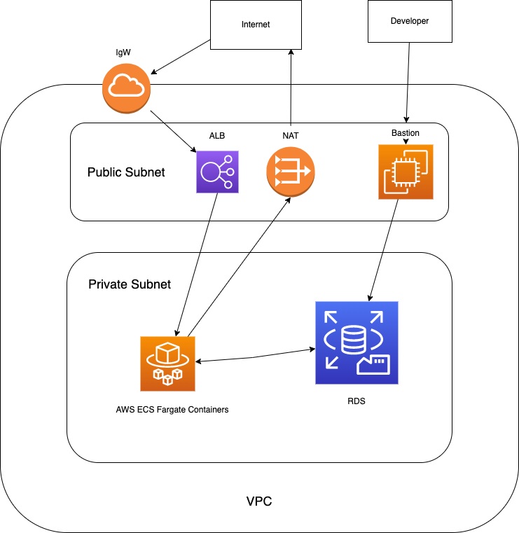

# Terraform AWS ECS diagram setup


# Create all resources with Terraform 
### Manual Steps
1. Add your AWS_ACCESS_KEY_ID and AWS_SECRET_ACCESS_KEY to github actions from Settings -> secrets and variables -> actions. Also, run AWS configure and add your AWS_ACCESS_KEY_ID and AWS_SECRET_ACCESS_KEY locally. These values can be changed in the ~/.aws/credentials file as well.
2. In secrets manager on AWS, make a secret called db_credentials and input the following key/value pairs. 
   ```
   DB_NAME = devopsDB
   username = <your desired db username>
   password = <your desired db password>
   ```
3. Go to AWS ECR, create a repo, and follow the push commands to push your image to Amazon ECR. Don't forget to change ECR_REGISTRY and ECR_REPOSITORY in .github/main.yml to what you have. Also, don't forget to update ecr_image in terraform.tfvars.
4. If adding a certificate to your load balancer to allow https trafic, go to your registrar (like GoDaddy or IONOS). Type in terraform apply and do not click yes. Get the output for the name servers and update these name servers in your GoDaddy, IONOS, etc. account. 
5. In terraform.tfvars, input your own values

### Automatic steps
1. Type in terraform apply and type in yes to apply when prompted
2. If there is an error coming from the certificate validation or it is taking longer than 10 minutes, ctrl+c out, and please wait 2 minutes and type in terraform apply again.

### Running in production
1. In your terraform.tfvars, whatever you put for fqdn will be the fully qualified domain name and your app will work on that domain. Also, change any variables to what you want. Your ecr_image variable will be different from mine and you can scale up or down the resources.

# Instructions to run the app locally
1. Install Node (Google Instructions)

2. Install Dependencies for the App
```sh
npm install
```

3. Run the app
```sh
npm start or docker-compose up
```

(Optional)
```sh
DB_NAME={name_of_db} DB_HOST={host_url_of_db} DB_USER={username_of_db} DB_PASS={password_of_db} npm start
```
to run `/db_healthcheck` endpoint

# CI/CD
* Any time you push to the main branch in github, a continuous integration and delivery process will be initiated to update the app in production. 


# Kubernetes
Path-based ingress:
* In ingress folder, do 
  ```
      kubectl apply -f nginx-deployment-and-service.yaml
      kubectl apply -f httpbin-deployment-and-service.yaml
      kubectl create namespace ingress-nginx
      helm install ingress-nginx ingress-nginx/ingress-nginx --namespace ingress-nginx
      kubectl apply -f path-based-ingress.yaml
      kubectl get svc --all-namespaces
  ```
* After getting services in all namespaces, get the external ip and go to \<external-ip>/nginx and \<external-ip>/httpbin for path-based routing